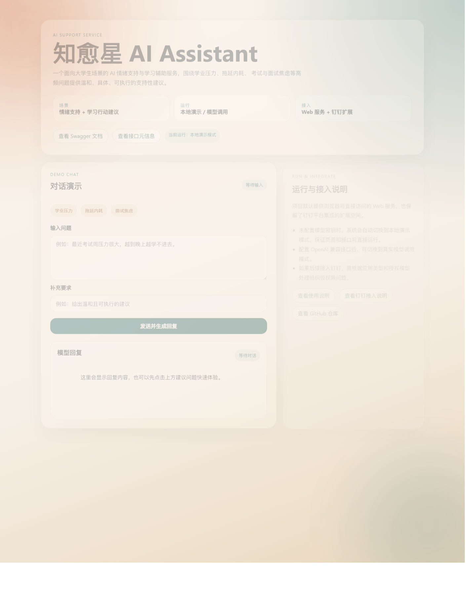
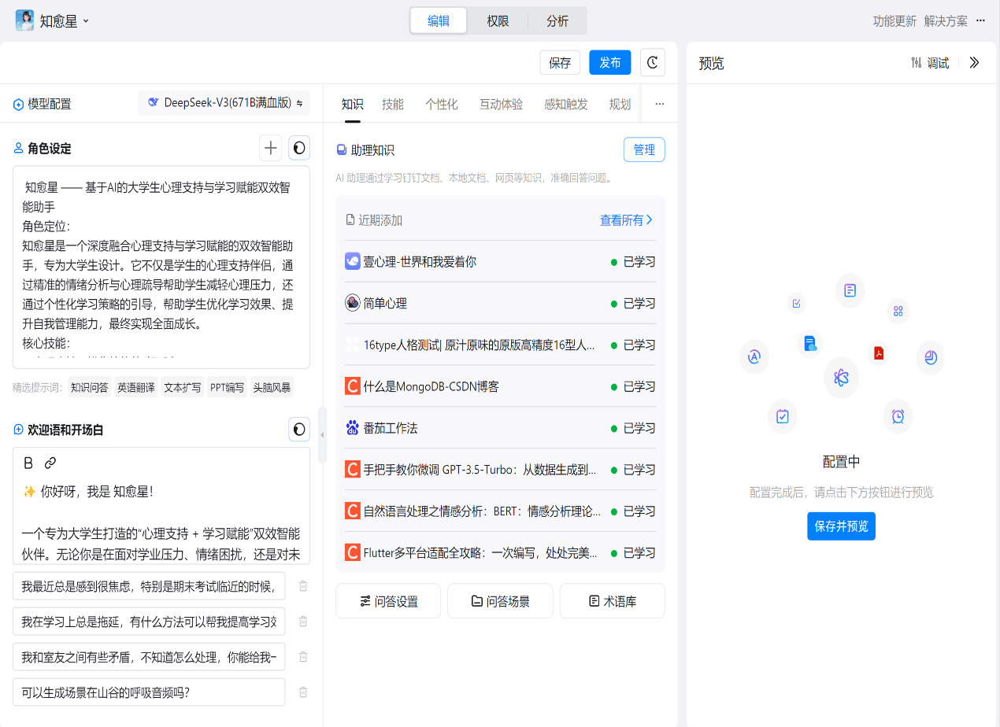
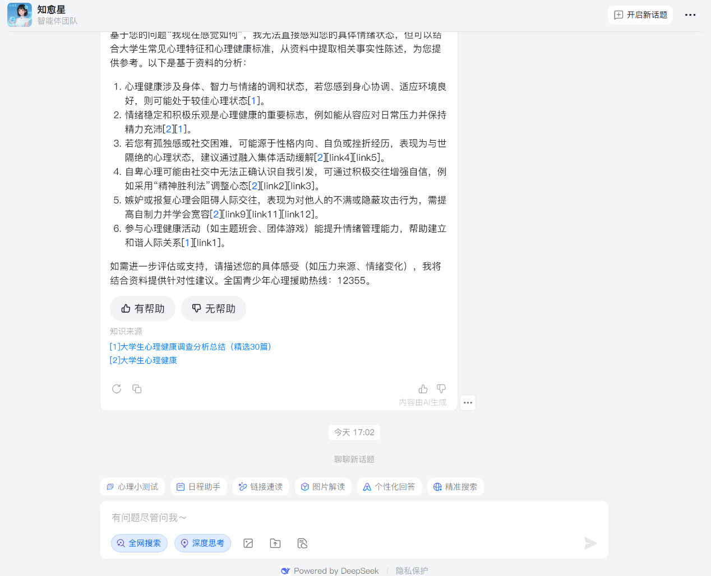
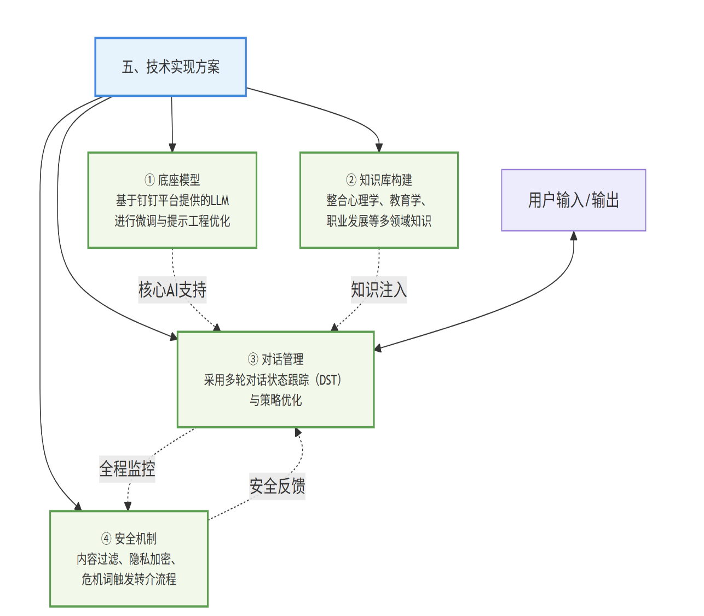

# 知愈星 AI Assistant


面向大学生场景的 AI 情绪支持与学习辅助服务，围绕学业压力、拖延内耗、考试与面试焦虑等高频问题，提供温和、具体、可执行的支持性建议。

这个仓库的目标不是单纯展示方案，而是提供一个可以直接运行、便于继续开发、也能逐步接入钉钉等平台的完整项目基础。

## 项目价值

- 聚焦真实且高频的大学生使用场景，而不是泛化聊天。
- 把“情绪支持”和“学习行动建议”放进同一轮对话，形成更完整的支持闭环。
- 支持无密钥运行的本地演示模式，拿到仓库后可以直接启动和体验。
- 预留模型调用和钉钉集成空间，便于后续继续做成更完整的产品。

## 核心能力

- `情绪支持对话`：识别压力、焦虑、拖延等常见表达，给出温和回应。
- `学习行动建议`：把大问题拆成可立刻执行的小步骤，降低启动门槛。
- `双运行模式`：未配置模型密钥时使用本地演示模式；配置后切换到 OpenAI 兼容模型调用模式。
- `Web 服务化`：提供可直接访问的页面、健康检查、接口元信息和 Swagger 文档。
- `工程基础`：包含测试、CI、环境变量说明和补充文档。

## 使用场景

- 学业压力大，任务很多，不知道从哪里开始
- 长期拖延，明知道该做但迟迟启动不了
- 考试、答辩、面试前持续紧张，难以进入准备状态
- 情绪混乱导致学习节奏失序，需要先稳定状态再恢复行动

## 运行模式

| 模式 | 说明 | 需要的配置 |
| --- | --- | --- |
| 本地演示模式 | 使用内置规则生成支持性回复，适合本地启动、调试界面和展示流程 | 无需 API Key |
| 模型调用模式 | 调用 OpenAI 兼容接口生成回复，适合继续做真实能力验证 | `OPENAI_API_KEY` |

项目默认优先保证“拿到就能跑”。如果没有配置模型密钥，页面和 `/chat` 接口仍然可以完整返回结果。

## 页面预览

### 独立 Web 页面

当前仓库默认运行的是独立 Web 页面，不需要打开钉钉即可访问和体验。



### 钉钉接入场景示意

下面两张图保留为钉钉平台接入场景示意，用于说明项目后续可以如何落到企业协同平台中。





## 技术栈

- Python 3.13
- FastAPI
- OpenAI Python SDK
- Pydantic
- python-dotenv
- Pytest
- GitHub Actions

## 架构图



## 快速启动

推荐使用 Python 3.13，以保持与当前本地开发和 CI 环境一致。

### 1. 安装依赖

```bash
python -m venv .venv
.venv\Scripts\activate
python -m pip install -r requirements.txt -r requirements-dev.txt
```

### 2. 配置环境变量

```powershell
Copy-Item .env.example .env
```

在 `.env` 中配置：

- `OPENAI_API_KEY`：可留空，留空时自动进入本地演示模式
- `OPENAI_BASE_URL`
- `MODEL_NAME`
- `DEMO_MODE`：可选，设置为 `true` 时强制使用本地演示模式

### 3. 启动服务

```bash
python -m uvicorn app:app --reload
```

启动后可访问：

- `http://127.0.0.1:8000/`
- `http://127.0.0.1:8000/api/meta`
- `http://127.0.0.1:8000/health`
- `http://127.0.0.1:8000/docs`
- `http://127.0.0.1:8000/project-docs/usage-guide.md`

### 4. 运行测试

```bash
python -m pytest -vv
```

## 接口概览

- `GET /`：Web 页面入口
- `POST /chat`：对话接口
- `GET /health`：服务健康检查
- `GET /api/meta`：服务元信息与当前运行模式
- `GET /docs`：Swagger 文档
- `GET /project-docs/...`：项目补充文档

### `POST /chat`

请求示例：

```json
{
  "message": "这周压力很大，感觉完全学不进去。",
  "system_hint": "给出温和且可执行的建议"
}
```

返回示例：

```json
{
  "reply": "当前状态里明显存在压力堆积，可以先不追求一次解决整周问题，而是把任务缩小到今天最容易开始的一步，比如先完成 20 分钟复习。",
  "note": "当前为模型调用模式。回复由配置的 OpenAI 兼容接口生成。",
  "mode": "openai"
}
```

## 文档入口

- [docs/project-report.md](docs/project-report.md)：完整项目报告与方案背景
- [docs/usage-guide.md](docs/usage-guide.md)：运行模式、环境变量和常见问题说明
- [docs/dingtalk-integration.md](docs/dingtalk-integration.md)：钉钉权限模型与集成边界说明

## 安全边界

- 项目定位是情绪支持和学习辅助，不替代专业心理诊断或治疗。
- 当前实现强调温和、具体、避免危险引导的回复风格。
- 如果用户出现持续失眠、严重低落或自伤相关表达，实际产品应优先引导线下求助与转介。

## 钉钉接入说明

- Web 页面是默认入口，便于直接访问和继续开发。
- 钉钉是可选的真实业务接入场景，不影响项目本身独立运行。
- 如果接入钉钉，需要根据企业内部应用、多组织分发或用户授权模式处理权限问题。

## 测试与持续集成

- 本地测试命令：`python -m pytest -vv`
- 仓库已配置 GitHub Actions，在推送后自动运行基础测试
