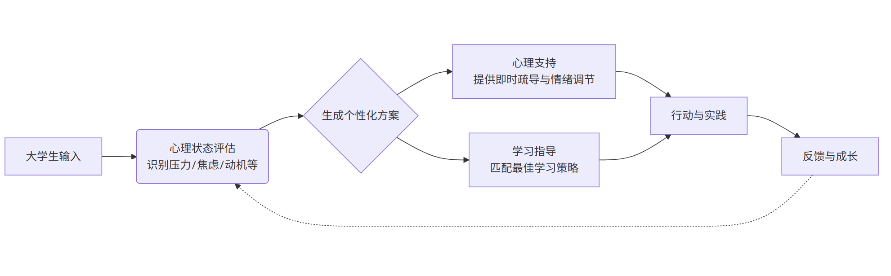
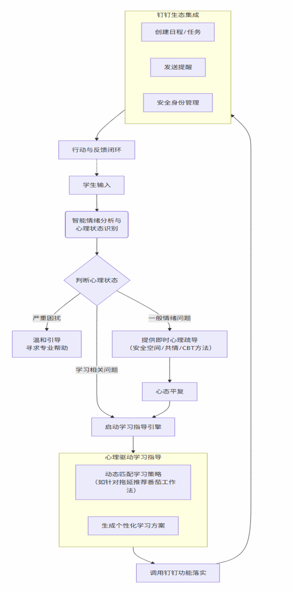
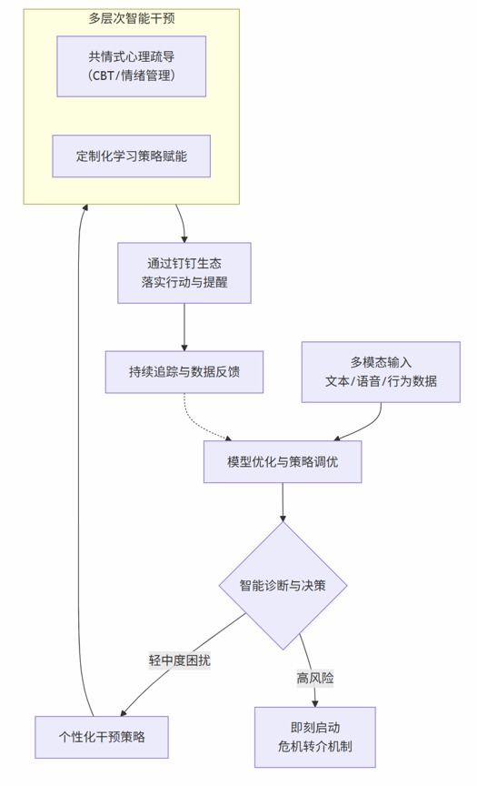
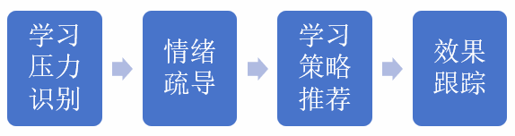
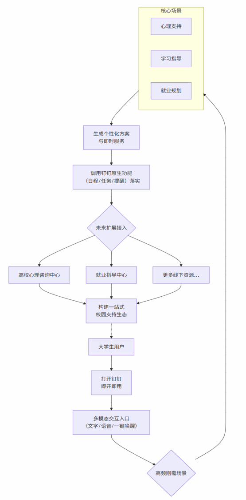
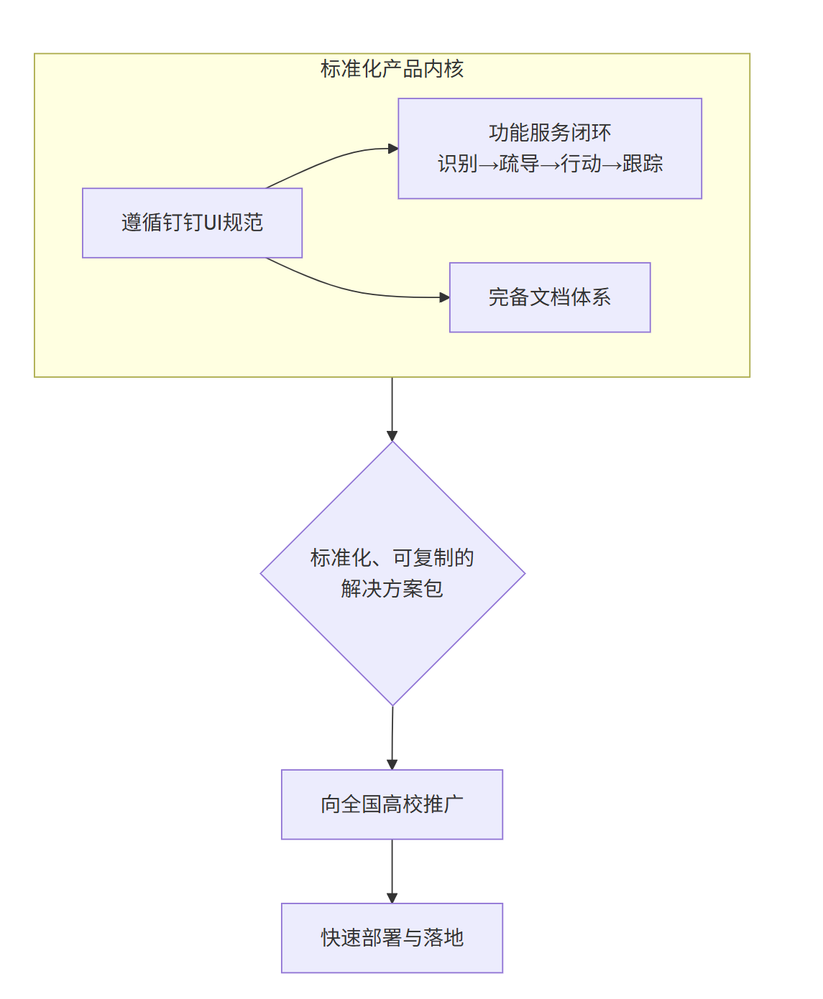

# 知愈星项目报告

> 这份文档保留项目的完整方案、流程图和界面示意。对外展示请优先查看 [README](../README.md)。

## 1. 项目定位

**知愈星**是一款面向大学生场景的 AI 心理支持与学习赋能助手，围绕“情绪支持 + 学习指导”两条主线，尝试通过大模型对话、心理学知识与钉钉生态集成，提供更及时、更个性化的陪伴式服务。

与普通问答助手相比，知愈星更强调以下三点：

- 以大学生高频问题为核心场景：学业压力、社交焦虑、自我怀疑、拖延与学习内耗。
- 以心理状态驱动学习建议：不是单纯推荐学习方法，而是结合情绪与动机状态给出策略。
- 以可落地的校园使用方式为目标：依托钉钉平台，尽量降低使用门槛。

## 2. 问题背景

大学生常见的心理压力来源包括：

- 学业竞争与长期压力；
- 人际关系中的疏离感与社交焦虑；
- 对未来方向的不确定与价值迷茫；
- 就业环境带来的持续焦虑。

传统心理辅导往往存在资源紧张、覆盖范围有限、预约周期长等问题，因此难以满足“高频、小步、即时”的支持需求。项目方案希望利用 AI 在文本理解、情绪识别和个性化推荐方面的优势，补足这类需求空缺。

## 3. 核心目标

### 3.1 心理支持

- 为用户提供即时、非评判式的倾诉入口；
- 通过共情式对话与基础认知引导，帮助缓解焦虑与压力；
- 在识别到风险表达时，温和引导用户寻求专业帮助。

### 3.2 学习赋能

- 根据心理特征匹配学习方法与行动建议；
- 提供时间管理、记忆方法、学习节奏调整等策略；
- 帮助用户从“情绪混乱”逐步回到“可执行行动”。

*课题目标流程图*

## 4. 功能设计

### 4.1 心理支持模块

1. **情绪识别与及时回应**  
   通过文本等输入分析情绪状态，捕捉焦虑、压力、低落等信号，生成更具共情感的回复。

2. **安全倾诉空间**  
   提供匿名、低门槛、无评判的交流环境，降低求助心理成本。

3. **心理疏导方法支持**  
   方案中引入认知行为疗法（CBT）、情绪管理、积极心理学等思路，为用户提供基础疏导建议。

4. **风险识别与转介**  
   当出现较高风险表达时，系统应优先触发提醒与转介机制，而不是继续普通闲聊。

### 4.2 学习指导模块

1. **多样化学习方法推荐**  
   包括番茄工作法、思维导图、间隔复习等常见策略。

2. **动态策略适配**  
   根据焦虑、拖延、注意力分散等状态调整建议方式。

3. **学习内耗干预**  
   先做情绪疏导，再做行动拆解，帮助用户重建学习动力。

4. **个性化学习方案生成**  
   根据心理特点、学习风格与任务目标输出行动路径。

### 4.3 钉钉生态集成

- 接入钉钉学习群、日程、任务等原生能力；
- 支持消息唤醒、提醒与协同流程；
- 借助组织能力做权限、身份与数据保护。

*核心功能流程图*

## 5. 创新点

### 5.1 双效合一

项目把“心理支持”和“学习赋能”作为一个联动系统，而不是两个孤立功能。情绪改善会提升行动力，行动反馈又会反向改善情绪。

### 5.2 心学联动

不是只给“安慰”，也不是只给“方法”，而是把“情绪梳理 → 学习策略 → 行动跟踪”做成闭环。

### 5.3 伦理设计

方案明确强调：

- 对危机表达做识别与转介；
- 不把 AI 视作专业医疗替代；
- 重视隐私保护与风险边界。

*项目创新流程图*

*心学联动机制流程图*

## 6. 技术方案

从比赛方案文档来看，项目的实现设想主要包括：

- **大模型能力**：基于钉钉平台提供的 LLM 或兼容模型能力，配合提示工程优化；
- **知识库构建**：整合心理学、教育学、职业发展等领域知识；
- **对话管理**：使用多轮对话状态跟踪与策略优化；
- **安全机制**：内容过滤、隐私加密、危机词触发转介流程。

> 说明：以上为方案层面的技术设计；比赛文档中未包含完整的可复现后端源码与钉钉线上配置。

*技术架构图*

## 7. 完整度与交付

方案文档中强调了以下交付方向：

- 形成“识别 → 疏导 → 建议 → 跟踪”的完整闭环；
- 遵循钉钉 UI 规范进行界面设计；
- 提供说明文档、架构图、流程图与测试材料。

*实用性与落地性流程图*

*服务闭环图*

## 8. 界面展示

### 8.1 平台视图

### 8.2 对话示意

## 9. 当前 GitHub 版本说明

为了更适合放到 GitHub，本仓库做了两件事：

1. 把原始比赛文档整理成可直接预览的 Markdown；
2. 补了一个最小可运行的演示版 API，方便后续继续完善。

如果你后面要拿这个仓库去投实习，建议继续补这三项：

- 实际可运行的对话接口与页面；
- 简单的心理知识库 / FAQ 检索；
- 风险词识别与转介逻辑的代码实现。
